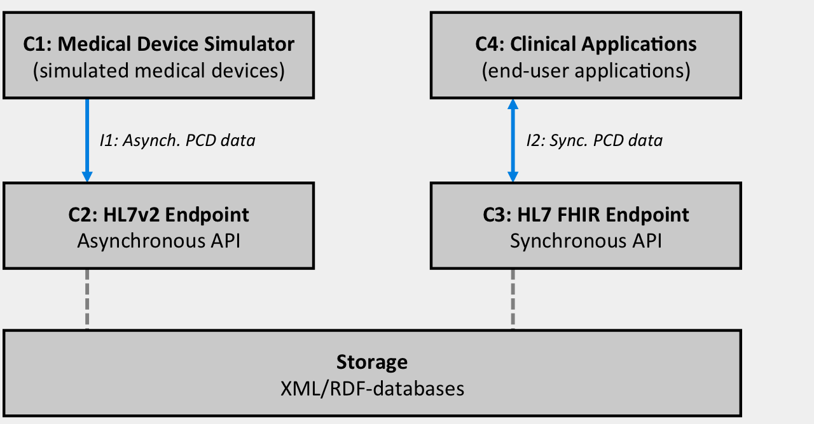

Overall schematic
-----------

A major technical goal of the SLL Medical Device Integration (MDI) Lab has been to build a proof-of-concept infrastructure for vendor neutral hospital-wide management of Patient Care Device (PCD) data. Capabilities of this infrastructure include:

 * Continuous collection and validation of PCD-data from medical device systems.
 * Persistent storage of collected data using a canonical data structure.
 * Exposure/distribution of data to other clinical IT-systems such as a Patient Data Management System (PDMS).

The resulting infrastructure features a highly modular design, consisting of self-contained software components that are interconnected using well-defined communication interfaces. Any component can be transparently replaced with a commercial alternative (as these become available on the market). For example, the Medical Device Simulator can be replaced with a IHE PCD compliant patient monitoring gateway. 

The diagram below summarizes the most important components of our proof-of-concept infrastructure, along with the overall flow of device observation data (as indicated by arrows). The *C2* and *C3* components (including storage) are sometimes collectively referred to as a *T5-system*. 

Description of integrations
-----------

### Integration #1: Asynchronous PCD Data

The MDI Lab supports medical device integration according to the [IHE PCD Technical Framework](http://www.ihe.net/Technical_Frameworks/#pcd). Additionally, the [IHE PCD WCM trial supplement](http://www.ihe.net/Technical_Framework/upload/IHE_PCD_Suppl_WCM.pdf) is supported. Consequently, all medical devices are expected to submit device observation data in accordance with the [IHE-PCD-01 transaction](http://www.ihe.net/uploadedFiles/Documents/PCD/IHE_PCD_TF_Vol2.pdf). If a specific medical device does not support the IHE PCD framework, a 3rd-party adapter solution will be required. 

| Item                 | Value                                                     |
| -------------------- | -------------                                             |
| Data transfer    	   | MLLP-over-TCP                                             |
| Transaction format   | HL7v2 unsolicited according to the IHE-transaction PCD-01 |
| Semantics            | IEEE 11073                                                |

### Integration #2: Synchronous PCD data

The MDI Lab supports clinical application integration according to the [HL7 FHIR DSTU 2 integration framework](http://www.hl7.org/FHIR/2015Jan/index.html). Currently, a REST-API is provided for exchange and manipulation of FHIR-resources. The original IEEE 11073 device observation data semantics are re-used whenever possible. 

| Item                 | Value                                                     |
| -------------------- | -------------                                             |
| Data transfer    	   | TCP                                      			       |
| Transaction format   | HL7 FHIR DSTU 2 (REST)									   |
| Semantics            | IEEE 11073                                                |

Description of components
-----------

### C1: Medical Device Simulator
In order to simplify testing of other components within the lab, a Medical Device Simulator has been implemented. The application simulates a patient monitoring gateway implementing the IHE DEC DOR actor, including the WCM supplement. 

 > Related source code respository: [DOR Driver](https://github.com/sll-mdilab/t5-dor-driver).

### C2: HL7v2 Endpoint
This component continuously collects, validates and stores device observation data from all medical device systems within the lab. It implements the IHE DEC DOC actor, including the WCM supplement, in order to achieve this. The component is implemented on top of the Apache Camel integration platform. 

 >  Related source code respository: [HL7v2 Endpoint](https://github.com/sll-mdilab/t5-doc).

### C3: HL7 FHIR Endpoint
This component exposes [HL7 FHIR DSTU 2 resources](http://www.hl7.org/FHIR/2015Jan/index.html) to clinical applications using the FHIR REST-API. A number of FHIR-resources relevant to the practical scope of the lab have been implemented (such as "Observation", "Patient", "Encounter" etc.). 

 >  Related documentation: [SLL MDI Lab FHIR Implementation Guide](/fhir).

The API has been implemented as a single service. The service exposes both non-modified device observation data as well as device observation data which has been enriched with patient-ID/device-ID information according to registered associations. This backend is also used for managing these associations as well as storing and serving a set of other FHIR resources. 
 
 >  Related source code respository: [FHIR X-Reference Backend](https://github.com/sll-mdilab/t5-pid-xref-manager).

### C4: Clinical Applications
The MDI Lab has developed a small set of web-based proof-of-concept applications. One of the purposes of these applications is to facilitate administration, troubleshooting and demonstration of the other components within the lab. These applications also showcase functionality that may could be possible in future clinical decision support system based on technologies such as FHIR. Additionally, they serve as best-practice examples of FHIR-enabled browser applications. 

### T5 Proof-of-Concept Web Application 
The following functionality is currently supported:

 * Admit/Discharge patients
 * Manage patient/Device association
 * Trouble-shooting of other components within the lab
 * Monitoring Live-data

>  Related source code respository: [T5 Web App](https://github.com/sll-mdilab/t5-web-app)

### Clinical Decision Support Proof-of-Concept Web Application
The following functionality is currently supported:

 * Live monitoring of vital signs
 * Viewing of vital sign history
 * Insertion of manual vital sign observation
 * Annotation of vital sign data
 * SBAR-based transfer between practitioners
 * Ordering of medications and specific vital sign monitoring
 * Pre-anesthetic assessments

>  Related source code respository: [CDS Web App](https://github.com/sll-mdilab/cds-web-app)

### AngularJS FHIR Library
Both of the above applications depend on the following FHIR-communication library for the AngularJS web development framework.

>  Related source code respository: [T5 Angular FHIR Resources](https://github.com/sll-mdilab/angular-fhir-resources)
